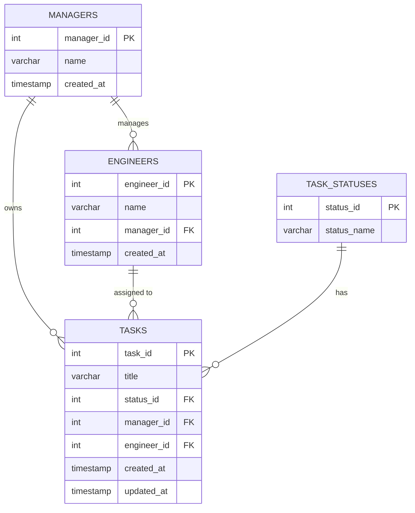

# Database Schema — Project Dashboard

Mock relational schema for the manager/engineer/task dashboard. Normalized to
third normal form (3NF): every non-key column depends on the whole primary
key and nothing but the primary key. A manager maps 1:1 to a single team, so
engineers and tasks reference the manager directly — there's no separate
`teams` table to join through.

## Entity Relationship Diagram



## Tables

### `managers`

| Column      | Type         | Constraints                 | Description                  |
|-------------|--------------|------------------------------|-------------------------------|
| manager_id  | INT          | PK, AUTO_INCREMENT          | Surrogate key                |
| name        | VARCHAR(100) | NOT NULL                    |                               |
| created_at  | TIMESTAMP    | NOT NULL, DEFAULT now()     |                               |

### `engineers`

| Column      | Type         | Constraints                          | Description                    |
|-------------|--------------|----------------------------------------|----------------------------------|
| engineer_id | INT          | PK, AUTO_INCREMENT                    | Surrogate key                  |
| name        | VARCHAR(100) | NOT NULL                              |                                 |               |
| manager_id  | INT          | FK → managers.manager_id, NOT NULL    | Which manager's team they're on |
| created_at  | TIMESTAMP    | NOT NULL, DEFAULT now()               |                                 |

### `task_statuses` (lookup)

| Column       | Type         | Constraints          | Description                          |
|--------------|--------------|------------------------|----------------------------------------|
| status_id    | INT          | PK, AUTO_INCREMENT    | Surrogate key                          |
| status_name  | VARCHAR(20)  | NOT NULL, UNIQUE      | `backlog` \| `inprogress` \| `done`    |

### `tasks`

| Column       | Type         | Constraints                                  | Description                              |
|--------------|--------------|-------------------------------------------------|--------------------------------------------|
| task_id      | INT          | PK, AUTO_INCREMENT                            | Surrogate key                             |
| title        | VARCHAR(200) | NOT NULL                                      |                                            |
| status_id    | INT          | FK → task_statuses.status_id, NOT NULL        |                                            |
| manager_id   | INT          | FK → managers.manager_id, NOT NULL            | Owning manager (whose board it's on)      |
| engineer_id  | INT          | FK → engineers.engineer_id, NULL              | NULL = unassigned                         |
| created_at   | TIMESTAMP    | NOT NULL, DEFAULT now()                       |                                            |
| updated_at   | TIMESTAMP    | NOT NULL, DEFAULT now() ON UPDATE now()       | Bumped on drag-and-drop status change     |

## SQL (Postgres-flavored)

```sql
CREATE TABLE managers (
    manager_id  SERIAL PRIMARY KEY,
    name        VARCHAR(100) NOT NULL,
    created_at  TIMESTAMP    NOT NULL DEFAULT now()
);

CREATE TABLE engineers (
    engineer_id SERIAL PRIMARY KEY,
    name        VARCHAR(100) NOT NULL,
    manager_id  INT          NOT NULL REFERENCES managers(manager_id),
    created_at  TIMESTAMP    NOT NULL DEFAULT now()
);

CREATE TABLE task_statuses (
    status_id   SERIAL PRIMARY KEY,
    status_name VARCHAR(20) NOT NULL UNIQUE
);

CREATE TABLE tasks (
    task_id      SERIAL PRIMARY KEY,
    title        VARCHAR(200) NOT NULL,
    status_id    INT       NOT NULL REFERENCES task_statuses(status_id),
    manager_id   INT       NOT NULL REFERENCES managers(manager_id),
    engineer_id  INT       REFERENCES engineers(engineer_id),
    created_at   TIMESTAMP NOT NULL DEFAULT now(),
    updated_at   TIMESTAMP NOT NULL DEFAULT now()
);
```
## Sample data

```sql
INSERT INTO managers (manager_id, name) VALUES
    (1, 'Jordan Ellis');

INSERT INTO engineers (engineer_id, name, manager_id) VALUES
    (1, 'Liam Nguyen',  1),
    (2, 'Priya Shah', 1),
    (3, 'Noah Park', 1);

INSERT INTO task_statuses (status_id, status_name) VALUES
    (1, 'backlog'), (2, 'inprogress'), (3, 'done');

INSERT INTO tasks (task_id, title, status_id, manager_id, engineer_id) VALUES
    (1, 'Design database schema',        1, 1, 1),
    (2, 'Set up CI pipeline',            1, 1, 1),
    (3, 'Write API documentation',       1, 1, 2),
    (5, 'Implement auth endpoints',      2, 1, 1),
    (7, 'Configure Terraform state bucket', 3, 1, 3);
```
