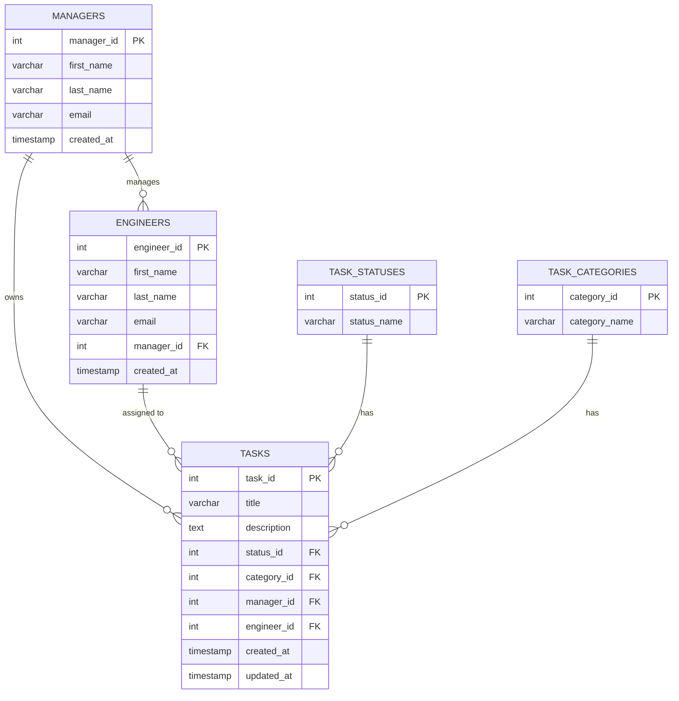

# Database Schema — Project Dashboard

Mock relational schema for the manager/engineer/task dashboard. Normalized to
third normal form (3NF): every non-key column depends on the whole primary
key and nothing but the primary key. A manager maps 1:1 to a single team, so
engineers and tasks reference the manager directly — there's no separate
`teams` table to join through.

## Entity Relationship Diagram



## Tables

### `managers`

| Column      | Type         | Constraints                 | Description                  |
|-------------|--------------|------------------------------|-------------------------------|
| manager_id  | INT          | PK, AUTO_INCREMENT          | Surrogate key                |
| first_name  | VARCHAR(50)  | NOT NULL                    |                               |
| last_name   | VARCHAR(50)  | NOT NULL                    |                               |
| email       | VARCHAR(255) | NOT NULL, UNIQUE            | Login / contact               |
| created_at  | TIMESTAMP    | NOT NULL, DEFAULT now()     |                               |

### `engineers`

| Column      | Type         | Constraints                          | Description                    |
|-------------|--------------|----------------------------------------|----------------------------------|
| engineer_id | INT          | PK, AUTO_INCREMENT                    | Surrogate key                  |
| first_name  | VARCHAR(50)  | NOT NULL                              |                                 |
| last_name   | VARCHAR(50)  | NOT NULL                              |                                 |
| email       | VARCHAR(255) | NOT NULL, UNIQUE                      | Login / contact                 |
| manager_id  | INT          | FK → managers.manager_id, NOT NULL    | Which manager's team they're on |
| created_at  | TIMESTAMP    | NOT NULL, DEFAULT now()               |                                 |

### `task_statuses` (lookup)

| Column       | Type         | Constraints          | Description                          |
|--------------|--------------|------------------------|----------------------------------------|
| status_id    | INT          | PK, AUTO_INCREMENT    | Surrogate key                          |
| status_name  | VARCHAR(20)  | NOT NULL, UNIQUE      | `backlog` \| `inprogress` \| `done`    |

### `task_categories` (lookup)

| Column         | Type         | Constraints          | Description                       |
|----------------|--------------|------------------------|--------------------------------------|
| category_id    | INT          | PK, AUTO_INCREMENT    | Surrogate key                       |
| category_name  | VARCHAR(20)  | NOT NULL, UNIQUE      | `feature` \| `maintenance`          |

### `tasks`

| Column       | Type         | Constraints                                  | Description                              |
|--------------|--------------|-------------------------------------------------|--------------------------------------------|
| task_id      | INT          | PK, AUTO_INCREMENT                            | Surrogate key                             |
| title        | VARCHAR(200) | NOT NULL                                      |                                            |
| description  | TEXT         | NULL                                           | Optional longer detail                    |
| status_id    | INT          | FK → task_statuses.status_id, NOT NULL        |                                            |
| category_id  | INT          | FK → task_categories.category_id, NOT NULL    |                                            |
| manager_id   | INT          | FK → managers.manager_id, NOT NULL            | Owning manager (whose board it's on)      |
| engineer_id  | INT          | FK → engineers.engineer_id, NULL              | NULL = unassigned                         |
| created_at   | TIMESTAMP    | NOT NULL, DEFAULT now()                       |                                            |
| updated_at   | TIMESTAMP    | NOT NULL, DEFAULT now() ON UPDATE now()       | Bumped on drag-and-drop status change     |

## SQL (Postgres-flavored)

```sql
CREATE TABLE managers (
    manager_id  SERIAL PRIMARY KEY,
    first_name  VARCHAR(50)  NOT NULL,
    last_name   VARCHAR(50)  NOT NULL,
    email       VARCHAR(255) NOT NULL UNIQUE,
    created_at  TIMESTAMP    NOT NULL DEFAULT now()
);

CREATE TABLE engineers (
    engineer_id SERIAL PRIMARY KEY,
    first_name  VARCHAR(50)  NOT NULL,
    last_name   VARCHAR(50)  NOT NULL,
    email       VARCHAR(255) NOT NULL UNIQUE,
    manager_id  INT          NOT NULL REFERENCES managers(manager_id),
    created_at  TIMESTAMP    NOT NULL DEFAULT now()
);

CREATE TABLE task_statuses (
    status_id   SERIAL PRIMARY KEY,
    status_name VARCHAR(20) NOT NULL UNIQUE
);

CREATE TABLE task_categories (
    category_id   SERIAL PRIMARY KEY,
    category_name VARCHAR(20) NOT NULL UNIQUE
);

CREATE TABLE tasks (
    task_id      SERIAL PRIMARY KEY,
    title        VARCHAR(200) NOT NULL,
    description  TEXT,
    status_id    INT       NOT NULL REFERENCES task_statuses(status_id),
    category_id  INT       NOT NULL REFERENCES task_categories(category_id),
    manager_id   INT       NOT NULL REFERENCES managers(manager_id),
    engineer_id  INT       REFERENCES engineers(engineer_id),
    created_at   TIMESTAMP NOT NULL DEFAULT now(),
    updated_at   TIMESTAMP NOT NULL DEFAULT now()
);
```

## Why this is 3NF

- **1NF** — every column holds a single atomic value (no comma-separated
  lists, e.g. an engineer has one row, not a repeating "tasks" field).
- **2NF** — every table uses a single-column surrogate primary key
  (`*_id`), so there's no composite key for a non-key column to be
  partially dependent on.
- **3NF** — no non-key column depends on another non-key column:
  - `tasks.status_id` and `tasks.category_id` point at lookup tables
    instead of storing the status/category text directly, so adding or
    renaming a status never requires touching every task row.
  - `engineers.manager_id` and `tasks.manager_id` reference `managers`
    directly rather than through a `teams` table — since a manager maps
    1:1 to a team, a separate team row would just be duplicating the
    manager's identity under another name, which is exactly the kind of
    redundancy 3NF avoids.

## Sample data

```sql
INSERT INTO managers (manager_id, first_name, last_name, email) VALUES
    (1, 'Jordan', 'Ellis', 'jordan.ellis@example.com');

INSERT INTO engineers (engineer_id, first_name, last_name, email, manager_id) VALUES
    (1, 'Liam',  'Nguyen', 'liam@example.com',  1),
    (2, 'Priya', 'Shah',   'priya@example.com', 1),
    (3, 'Noah',  'Park',   'noah@example.com',  1);

INSERT INTO task_statuses (status_id, status_name) VALUES
    (1, 'backlog'), (2, 'inprogress'), (3, 'done');

INSERT INTO task_categories (category_id, category_name) VALUES
    (1, 'feature'), (2, 'maintenance');

INSERT INTO tasks (task_id, title, status_id, category_id, manager_id, engineer_id) VALUES
    (1, 'Design database schema',        1, 1, 1, 1),
    (2, 'Set up CI pipeline',            1, 2, 1, 1),
    (3, 'Write API documentation',       1, 2, 1, 2),
    (5, 'Implement auth endpoints',      2, 1, 1, 1),
    (7, 'Configure Terraform state bucket', 3, 2, 1, 3);
```
