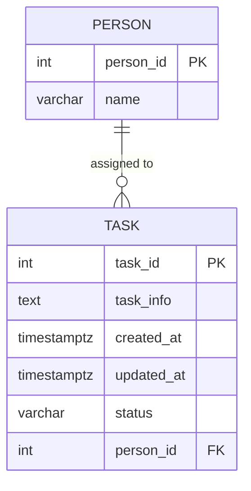

# Database Schema — Agile Board

Schema for the engineer/manager task board, as created by `init_db()` in
`db.py`. There's no separate `managers` table — the app only distinguishes
people by name, not by role, so both engineers and managers are rows in the
same `person` table. `status` is stored directly on `task` as a constrained
string rather than a separate lookup table, since the set of valid statuses
is fixed and small.

## Entity Relationship Diagram


```mermaid
erDiagram
    PERSON ||--o{ TASK : "assigned to"

    PERSON {
        int person_id PK
        varchar name
    }
    TASK {
        int task_id PK
        text task_info
        timestamptz created_at
        timestamptz updated_at
        varchar status
        int person_id FK
    }
```

## Tables

### `person`

| Column      | Type         | Constraints                 | Description            |
|-------------|--------------|------------------------------|--------------------------|
| person_id   | INT          | PK, GENERATED ALWAYS AS IDENTITY | Surrogate key       |
| name        | VARCHAR(50)  | NOT NULL                    |                          |

### `task`

| Column       | Type           | Constraints                                                                      | Description                          |
|--------------|----------------|-------------------------------------------------------------------------------------|-----------------------------------------|
| task_id      | INT            | PK, GENERATED ALWAYS AS IDENTITY                                                  | Surrogate key                          |
| task_info    | TEXT           |                                                                                     |                                          |
| created_at   | TIMESTAMPTZ    | DEFAULT CURRENT_TIMESTAMP                                                         |                                          |
| updated_at   | TIMESTAMPTZ    | DEFAULT CURRENT_TIMESTAMP                                                         |                                          |
| status       | VARCHAR(20)    | DEFAULT `'Unassigned'`, CHECK IN (`'Unassigned'`, `'In Progress'`, `'Done'`)      |                                          |
| person_id    | INT            | FK → person.person_id, ON DELETE SET NULL                                         | NULL = unassigned                      |

## SQL 

```sql
CREATE TABLE IF NOT EXISTS person (
    person_id INT GENERATED ALWAYS AS IDENTITY PRIMARY KEY,
    name VARCHAR(50) NOT NULL
);

CREATE TABLE IF NOT EXISTS task (
    task_id INT GENERATED ALWAYS AS IDENTITY PRIMARY KEY,
    task_info TEXT,
    created_at TIMESTAMPTZ DEFAULT CURRENT_TIMESTAMP,
    updated_at TIMESTAMPTZ DEFAULT CURRENT_TIMESTAMP,
    status VARCHAR(20) DEFAULT 'Unassigned' CHECK (status IN ('Unassigned', 'In Progress', 'Done')),
    person_id INT REFERENCES person(person_id) ON DELETE SET NULL
);
```

## Sample data

```sql
INSERT INTO person (name) VALUES
    ('Jordan Ellis'),
    ('Liam Nguyen'),
    ('Priya Shah'),
    ('Noah Park');

INSERT INTO task (task_info, status, person_id) VALUES
    ('Design database schema',           'Unassigned',  2),
    ('Set up CI pipeline',                'Unassigned',  2),
    ('Write API documentation',           'Unassigned',  3),
    ('Implement auth endpoints',          'In Progress', 2),
    ('Configure Terraform state bucket',  'Done',        4);
```

